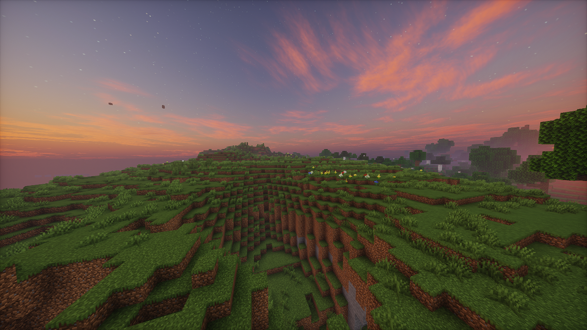

# 4U4N 无规则生存服务器 · 官方网站

[](LICENSE)
[](https://tailwindcss.com)
[](#语言切换)

> 一个为 Minecraft 无规则生存服务器打造的现代化单页官方网站，支持暗黑主题、中英切换、在线玩家显示、登录系统、实用工具等丰富功能。

<p align="center">
  
</p>

---

## 📋 目录

- [功能特性](#功能特性)
- [技术栈](#技术栈)
- [项目结构](#项目结构)
- [快速开始](#快速开始)
- [页面说明](#页面说明)
- [特色模块](#特色模块)
- [部署](#部署)
- [贡献指南](#贡献指南)
- [许可证](#许可证)

---

## 功能特性

### 🎨 用户体验
- **暗黑/明亮主题切换** — 一键切换，自动保存偏好（localStorage）
- **中/英双语切换** — 全局中英文切换，覆盖所有页面内容
- **自适应响应式设计** — 桌面端 / 平板 / 手机完美适配
- **自定义酷炫加载动画** — Minecraft 主题进度条 + 随机提示文字
- **背景音乐播放器** — 隐藏式迷你播放器，支持播放列表
- **打字机标题效果** — 动态打字动画展现服务器名称

### 🖥️ 核心页面
- **主页 (index.html)** — 展示服务器特色、IP 地址、种子、规则、团队、FAQ
- **文档页 (docs.html)** — 公告、更新日志、帮助指令、协管守则、服务条款

### 🛠️ 特色功能
- **在线玩家状态** — 实时显示服务器在线人数与玩家列表
- **登录系统** — 游戏内注册，网页端登录 / 注销
- **服务器实用工具** — 渐变文字生成器、特殊符号、史莱姆区块查询、生物群落查询
- **等级指南 (McMMO)** — 从 Markdown 文件加载完整的技能指南
- **服务条款弹窗** — 登录前需勾选同意条款

### 🔒 安全
- **控制台防护** — 启动开发者工具自动跳转警告
- **服务条款协议** — 登录强制勾选同意条款
- **用户会话管理** — 本地会话存储 + 安全的登出机制

---

## 技术栈

| 类别 | 技术 |
|------|------|
| **前端框架** | 原生 JavaScript (无框架) |
| **CSS 框架** | [Tailwind CSS 3.x](https://tailwindcss.com) (CDN) |
| **图标库** | [Font Awesome 6](https://fontawesome.com) (CDN) |
| **字体** | ZCOOL KuaiLe + 系统默认字体栈 |
| **后端 API** | Node.js (可选，仅登录功能需要) |
| **持久化** | localStorage / sessionStorage |
| **数据源** | Minecraft 服务器 API、Crafatar 头像 API |

---

## 项目结构

```
V3/
├── index.html                  # 主页面
├── docs.html                   # 服务器文档页
├── README.md                   # 项目说明（本文件）
│
├── css/                        # 样式表
│   ├── base.css                # 基础样式
│   ├── components.css          # 组件样式
│   ├── auth.css                # 登录弹窗样式
│   ├── modals.css              # 弹窗通用样式
│   ├── dark-theme.css          # 暗黑主题覆盖
│   ├── docs.css                # 文档页样式
│   ├── preloader.css           # 加载动画样式
│   ├── music-player.css        # 音乐播放器样式
│   ├── tools.css               # 工具页面样式
│   ├── responsive.css          # 响应式布局
│   └── titletype.css           # 标题特效
│
├── js/                         # JavaScript 脚本
│   ├── i18n.js                 # 🔥 多语言切换引擎（190+ 翻译键）
│   ├── theme.js                # 🌓 暗黑主题切换
│   ├── auth.js                 # 🔐 登录 / 注册 / 会话管理
│   ├── server-status.js        # 📡 在线玩家状态获取
│   ├── events.js               # 🖱️ 全局事件委托
│   ├── navigation.js           # 🧭 导航栏交互
│   ├── utils.js                # 🛠 工具函数
│   ├── preloader.js            # ⏳ 加载动画控制
│   ├── typing-effect.js        # ⌨️ 打字机效果
│   ├── music-player.js         # 🎵 背景音乐播放器
│   ├── carousel.js             # 🎠 轮播图
│   ├── qq-avatar.js            # 👤 QQ 头像加载
│   ├── anti-devtools.js        # 🚫 开发者工具检测
│   │
│   ├── docs.js                 # 📄 文档页逻辑（公告/帮助/条款渲染）
│   ├── terms.js                # 📜 服务条款 Markdown 渲染
│   ├── moderator-rules.js      # ⚖️ 协管守则
│   ├── mcmmo-loader.js         # 📚 McMMO 等级指南加载
│   │
│   ├── gradient-tool.js        # 🎨 渐变文字生成器
│   ├── slime-chunk.js          # 🟢 史莱姆区块查询
│   └── biome-chunk.js          # 🌍 生物群落查询
│
├── mcmmo-commands.md           # McMMO 技能指南（中文）
├── mcmmo-commands-en.md        # McMMO 技能指南（英文）
│
├── img/                        # 图片资源
│   ├── icon.png                # 网站图标
│   ├── 4u4n.png / 4u4nc.png   # Logo
│   ├── banner1~4.png           # 轮播图
│   └── *.png / *.jpg           # 其他图片
│
└── opt/
    └── auth-api/
        └── server.js           # 登录 API 后端（可选）
```

---

## 快速开始

### 前置要求

- 一个现代浏览器（Chrome / Firefox / Edge）
- 本地开发时需要一个 HTTP 服务器（如 Live Server、`npx serve`、Python `http.server` 等）

### 本地运行

```bash
# 1. 进入项目目录
cd V3

# 2. 启动本地服务器（任选一种）
npx serve .              # Node.js
python -m http.server    # Python
php -S localhost:8080    # PHP

# 3. 浏览器打开 http://localhost:3000
```

> ⚠️ 直接用 `file://` 协议打开可能导致 CORS 问题（在线玩家 API 请求被拦截）。

### 登录 API（可选）

如需启用登录功能：

```bash
cd opt/auth-api
npm install               # 安装依赖
node server.js            # 启动 API 服务器（默认 3001 端口）
```

然后修改 `js/auth.js` 中的 API 地址指向上方服务。

---

## 页面说明

### 主页 (index.html)

| 区域 | 说明 |
|------|------|
| **导航栏** | 固定顶部，含桌面/移动端两套菜单、主题切换、语言切换 |
| **Hero** | 打字机标题 + 在线人数 + 玩家列表 |
| **特色** | 4 张特色卡片（粘液科技、指令系统、无规则、起床战争） |
| **IP 地址** | 三条线路 IP（主线/副线/快捷）+ 一键复制 |
| **种子** | 世界种子展示 + 复制 |
| **优势** | 4 张优势卡片 |
| **规则** | 服务器内 & 群内规则 |
| **团队** | 核心成员 + 协助管理员展示 |
| **FAQ** | 4 个折叠问答 |
| **页脚** | 快速链接 + 联系方式 |

### 文档页 (docs.html)

| 分区 | 内容来源 |
|------|---------|
| **公告** | `docs.js` 内嵌 Markdown |
| **更新内容** | 静态占位，待后续填充 |
| **帮助** | 指令速查表（支持点击复制） |
| **协管守则** | `moderator-rules.js` 加载 |
| **服务条款** | `terms.js` 加载（中英双语） |

---

## 特色模块

### 🌐 多语言切换 (i18n)

- 引擎文件：`js/i18n.js`
- 覆盖范围：190+ 翻译键，涵盖所有页面文本
- 翻译策略：静态文本用 `data-i18n` 属性，动态文本用 `window.t()`
- 持久化：`localStorage('4u4n_lang')`，跨页面同步
- 事件广播：语言切换时派发 `langchange` 事件，各模块监听刷新

```html
<!-- 静态文本示例 -->
<span data-i18n="nav_features">特色</span>

<!-- 动态文本示例 -->
<script>
  alert(window.t('copy_success'));
</script>
```

### 🌓 暗黑主题

- 引擎文件：`js/theme.js` + `css/dark-theme.css`
- 使用 `data-theme="dark"` 属性控制
- 切换按钮 ID：`theme-toggle-desktop` / `theme-toggle-mobile`
- 持久化：`localStorage('4u4n_theme')`

### 🛡️ 服务条款协议

登录强制勾选"我已阅读并同意服务条款"复选框。从登录弹窗点击条款会打开文档页并**仅在该流程中**显示底部同意栏。

---

## 部署

### 静态部署（推荐）

直接将文件上传至任意静态托管平台：

- **GitHub Pages**
- **Netlify**
- **Vercel**
- **Cloudflare Pages**
- **阿里云 OSS / 腾讯云 COS**

所有代码均为纯前端，无需构建步骤。

### 注意事项

1. **Tailwind CSS** 通过 CDN 引入，生产环境建议使用本地编译版本以减少加载时间
2. 登录 API 需要单独部署后端（`opt/auth-api/server.js`）
3. 修改 `js/server-status.js` 中的 Minecraft 服务器地址
4. QQ 群二维码和头像图片使用外部 API（`q1.qlogo.cn`），请确保网络可访问

---

## 贡献指南

欢迎提交 Issue 和 Pull Request！

### 开发约定

- **CSS**: 使用 Tailwind 工具类优先，自定义样式放入对应 CSS 文件
- **JS**: ES5 兼容写法（无箭头函数、无模板字符串），IIFE 封装
- **i18n**: 新增文本必须在 `js/i18n.js` 中同时提供中英翻译
- **模块**: 每个功能独立 JS 文件，通过 `window` 暴露公共接口

### 新增翻译

```javascript
// 在 js/i18n.js 的 dict 对象中添加
dict = {
    ...
    your_key: { zh: '你的中文', en: 'Your English' },
};
```

### 提交规范

- `feat: 新增 XXX 功能`
- `fix: 修复 XXX 问题`
- `i18n: 翻译 XXX`
- `style: 调整 XXX 样式`

---

## 许可证

MIT License © 2026 StarCraft Network

---

## 联系我们

- **官方 QQ 群**: 1104679773 / 758633338
- **邮箱**: Feedback@4u4n.fun
- **服务器 IP**: `4u4n.fun`

<p align="center">
  <sub>Made with ❤️ by StarCraft Network · 4U4N Anarchy Survival Server</sub>
</p>
